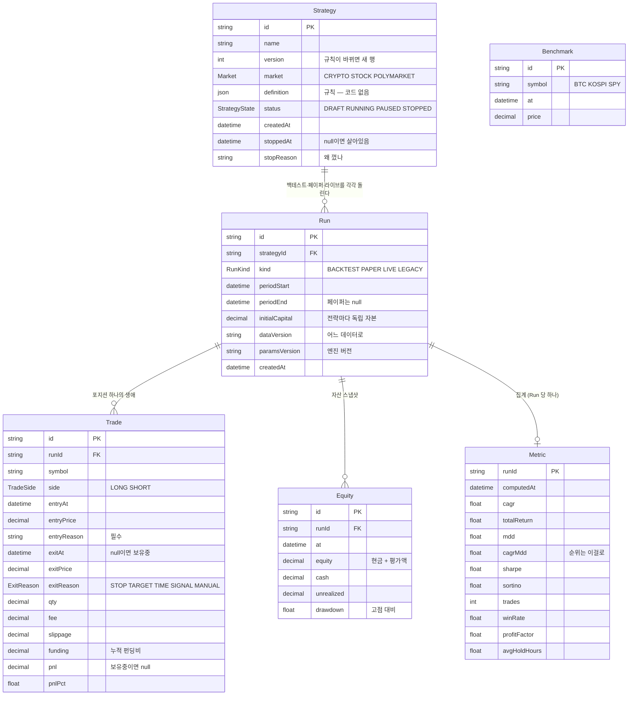

# 데이터 모델 — STRATEGY LAB

| | |
|---|---|
| **근거** | `LAB-02` |
| **적용일** | 2026-09-11 |
| **마이그레이션** | `prisma/migrations/20260911000000_lab02_strategy_lab/` |
| **롤백** | `prisma/rollback/20260911000000_lab02_strategy_lab.down.sql` |

> **백테스트와 페이퍼가 같은 테이블에 쌓인다**(§0). 따로 두면 비교할 수 없다.
> `Run.kind` 하나로 갈라진다.

---

## 다이어그램



`Benchmark` 는 어디에도 붙지 않는다 — **모든 화면이 같은 기간을 잘라 옆에 둔다**(LAB-00 §7).
Run 에 매어두면 Run 마다 같은 시세를 복제하게 되고, 벤치마크가 Run 의 소유물처럼 보인다.

---

## 결정과 이유

### 왜 `Trade` 가 포지션의 생애인가

지시서 A-3 의 필드가 `entry_*` · `exit_*` 로 짝지어져 있다. 한 행이 **진입에서 청산까지**다.

레거시 `LegacyTrade`(옛 `Trade`)는 **체결 한 건**이다 — `action: BUY|SELL|CLOSE`,
`quantity`, `price`. 알갱이가 달라서 합칠 수 없었다. 합치면 `trades` 집계가
주문 수를 세게 되고 `win_rate` 가 의미를 잃는다.

옛 `Position` 이 알갱이는 가깝지만(`entryPrice`·`exitPrice`·`realizedPnl`),
`botId` 를 요구하고 `Run` 개념이 없다. `LAB-07` 이 `apps/api` 를 새 테이블로
옮길 때 `Position` → `Trade` 가 실제 이전 경로가 된다.

### 왜 레거시를 개명했나

랩이 `Strategy` · `Trade` 라는 이름을 쓴다. Prisma 모델 이름은 유일해야 하므로
둘 중 하나가 비켜야 했다. **랩이 제품이므로 랩이 좋은 이름을 갖는다.**

| 전 | 후 | 데이터 |
|---|---|---|
| `Strategy` | `LegacyStrategy` | **그대로.** `ALTER TABLE RENAME` |
| `Trade` | `LegacyTrade` | **그대로.** `ALTER TABLE RENAME` |

`Bot` · `Position` · `StrategySession` · `StrategyRun` 은 이름이 겹치지 않아 그대로 뒀다.
`LAB-07` 이 `apps/api` 를 새 테이블로 옮기면 `Legacy*` 는 그때 사라진다.

> **`prisma migrate diff` 를 그대로 쓰면 안 된다.** Prisma 는 개명을 인식하지 못해
> 기존 테이블의 컬럼을 전부 `DROP` 하고 빈 `Legacy*` 를 만드는 SQL 을 낸다.
> 마이그레이션의 개명 블록은 손으로 썼고, 그 뒤 블록은 **개명이 적용된 DB 에서
> diff 를 다시 떠서** 붙였다. 그래서 마이그레이션에 `DROP` 문이 하나도 없다.

### 필드 이름을 camelCase 로 쓴 이유

지시서는 `strategy_id` · `entry_at` 처럼 snake_case 로 적었다. 이 레포의 나머지
38개 모델은 전부 camelCase 컬럼이다. 한 스키마에 두 규약을 섞는 쪽이 더 나쁘다고 보고
camelCase 로 통일했다. 대응은 1:1 이다 — `strategy_id` → `strategyId`, `cagr_mdd` → `cagrMdd`.

**전략 정의 JSON 안은 지시서 그대로 snake_case 다**(`stop_pct` · `max_hold_days` ·
`risk_pct` · `max_positions`). 그건 DB 컬럼이 아니라 지시서가 정한 데이터 형식이다.

---

## 전략 정의 검증

`packages/lab/src/strategy-definition.ts` — 순수 함수, `@fomo/lab` 로 노출.

| 강제하는 것 | 근거 |
|---|---|
| `stop_pct` 없으면 **거부** (null 도, 0 이상도 거부) | 완료확인 4 |
| 지표는 이름으로만 (`^[a-z][a-z0-9_]*$`) — 괄호·연산자·공백 불가 | PART B-1 "정의에 코드가 없다" |
| 지표 인자는 원시값만 — 객체·배열 불가 | PART B-1 |
| `all` / `any` 중첩 **2단계까지** | PART B-1 |
| 한 노드는 `all` 이나 `any` 중 하나만 | 모호한 조합 금지 |
| 빈 조건 목록 거부 | `[]` 와 "조건 없음"은 다르다 |
| `target_pct` 생략 거부 — 목표 없음은 `null` 로 **명시** | 생략과 선택을 구분한다 |
| `leverage` 생략 시 **1** | LAB-00 §7 레버리지 기본 1배 |

저장 경로는 `apps/web/lib/lab/strategy-store.ts` 하나다. `createStrategy` ·
`reviseStrategy` 가 `assertStrategyDefinition` 을 먼저 지난다 —
**검증 함수가 있는 것과 저장이 거부되는 것은 다른 주장이라** 문을 하나로 좁혔다.

`updateDefinition` 이 없다. 규칙이 바뀌면 `reviseStrategy` 가 **버전을 올린 새 행**을
만든다(PART A-1). 옛 행을 고치면 그 행을 참조하는 `Run` 의 숫자가 어떤 규칙으로 난
것인지 알 수 없게 되고, 그러면 백테스트 결과 전부가 못 믿을 것이 된다.

---

## 판단 원장 이전 (PART C)

`scripts/lab/import-judgment-ledger.ts` — **원장은 읽기만 한다.**

| 원장 | Trade |
|---|---|
| `kind='selection'` 의 `ts` | `entryAt` |
| `priceAt` | `entryPrice` |
| `payload.signalTypes` · `payload.pickType` | `entryReason` |
| `kind='outcome'` (`payload.selectionId` + `windowDays`) | `exitAt` · `exitPrice` · `exitReason=TIME` |

### Run 을 여럿 만든 이유

지시서는 "별도 Run(kind: legacy)" 이라고 썼다. 그런데 채점 창이 **7·30·90일 셋**이다
(`TRACK_WINDOWS`). 셋을 한 Run 에 넣으면 같은 발행이 세 번 겹쳐 그 Run 의 자산곡선과
지표가 의미를 잃는다. **지표를 지는 단위가 Run 이므로 창은 Run 에 붙는다.**

- Strategy = 자산별 (`kr-stock` · `us-stock` · `coin`) — 시장이 다르다
- Run = 자산 × 창, `kind=LEGACY`
- `asset='macro'` 는 체결 대상이 아니라 제외

### 이 Run 들을 절대 수익률로 비교하면 안 되는 이유

원장에 **수량·수수료·슬리피지가 없다.** 발행과 가격만 있다. 그래서 `qty=1`(단위
포지션), `fee=slippage=funding=0` 으로 넣었다. 구멍을 메운 것이 아니라 **원장에 없던
것을 0 으로 적은 것**이고, 비용 0 인 성적은 비용을 물는 랩 전략보다 무조건 좋아 보인다.
`kind=LEGACY` 가 순위에서 빠지는 이유가 이것이다.

채점 전인 발행은 `exitAt=null`(보유중)로 넣는다. **버리지 않는다.**

재실행 안전: id 를 `lg-<selectionId>-t<window>` 로 결정적으로 만든다.

---

## 벤치마크 (PART D)

`scripts/lab/collect-benchmark.ts` — Binance 공개 klines(키 없음).

이건 **벤치마크 가격 소스**이고 LAB-00 §9 의 "거래소" 결정이 아니다 — 그건 `LAB-03` 전에 정한다.
주식 벤치마크(KOSPI·SPY)는 `LAB-09` 에서 붙는다.

**받은 봉만 넣는다.** 빠진 날을 앞뒤 값으로 채우지 않고, 구간을 세서 보고한다
(LAB-00 §7 데이터 구멍을 메우지 않는다).

---

## 마이그레이션 · 롤백

Prisma 는 down 마이그레이션을 만들지 않는다. 손으로 쓰고 **실제로 돌려서 확인한다.**

```bash
npm run lab:migrate          # prisma migrate deploy
npm run lab:migrate:verify   # 적용 → 데이터 넣기 → 롤백 → 살아남았나 → 재적용
```

`lab:migrate:verify` 는 **스키마를 비운다.** 호스트가 로컬이 아니면 거부하고,
`LAB_MIGRATE_VERIFY_ALLOW_REMOTE=yes` 를 명시해야만 넘어간다.

마이그레이션 이력이 없던 레포라 `0_init` 을 기존 38개 모델의 베이스라인으로 먼저 넣었다.
**이미 그 스키마가 서 있는 DB(프로덕션)에서는 `0_init` 을 적용하지 말고 적용된 것으로 표시한다:**

```bash
npx prisma migrate resolve --applied 0_init
npx prisma migrate deploy
```
